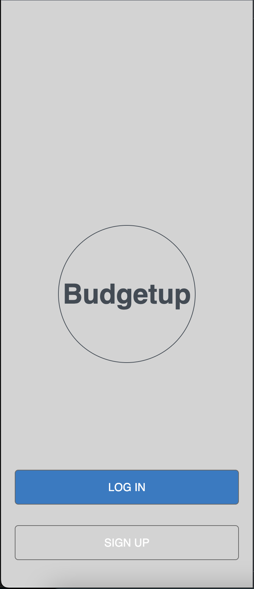

 

# BudgetUp

>This is a mobile budget app created using ruby on rails. It follows a [design](https://www.behance.net/gallery/19759151/Snapscan-iOs-design-and-branding?tracking_source=) idea by [Gregoire Vella on Behance](https://www.behance.net/gregoirevella). The user can sign-up, sign-in, create categories and track expenditure on the different transactions.

# Quick view

## Built With

- Language: Ruby
- Frameworks: Ruby on Rails
- Testing: 
     - Unit : RSpec
     - Integration : Capybara
- IDE : vscode
- Database : PostgressSQL
- Template engine .erb
- Linters:
     - CSS: Stylelint
     - Ruby: Rubocop

## Entity relationship diagram for DB

## Live Demo
[Live Demo Link](https://budgetup.onrender.com/)

## Getting Started

- Check the Ruby version or if you  have one  by running `ruby -v` if you get something like this `ruby 2.6.8p205 (2021-07-07 revision 67951)` you have Ruby installed.
- Clone the repository by runiing  ssh: `git clone git@github.com:Nyame-Wolf/budget-app.git` or http:`git clone https://github.com/Nyame-Wolf/budget-app.git` in your CLI.
- `cd budget-app`
- Run `bundle install`
- Run `rails db:create db:migrate`
- Run `rails server`
- Open Browser `http://localhost:3000/`

## Testing

- Run `rspec`

## Authors

👤 **Mumenya Nyamu** 🧑🏻‍💻

- GitHub: [@Nyame-Wolf](https://github.com/Nyame-Wolf)
- Twitter: [@mumenyam](https://twitter.com/Mumenyam)
- LinkedIn: [LinkedIn](https://www.linkedin.com/in/mumenya-nyamu-software-engineer/)

## 🤝 Contributing

Contributions, issues, and feature requests are welcome!

Feel free to check the [issues page](https://github.com/Nyame-Wolf/budget-app/issues/).

## Show your support

Give a ⭐️ if you like this project!

## Acknowledgments

- Microverse
- Original [design](https://www.behance.net/gallery/19759151/Snapscan-iOs-design-and-branding?tracking_source=) idea by [Gregoire Vella on Behance](https://www.behance.net/gregoirevella)

## 📝 License

This project is [MIT](./MIT.md) licensed.

